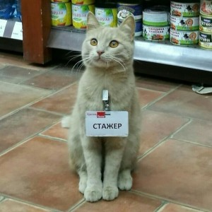

Oniskevich Denis Igorevich
============

-------------------     ----------------------------
__Contacts:__

GitLab                        https://gitlab.com

LinkedIn                      https://vk.com/onixxxxxxx

Gmail                         https://mail.google.com/mail/u/0/#inbox

-------------------     ----------------------------

About
---------
I do work developing applications and software for business

English level
:   **Intermediate**

Skills
---------
- HTML / HTML5
- CSS / CSS3 / SASS / LESS
- JavaScript
- Jquery
- Express
- React
- Node js
- Figma

Code example
---------
[GitLab](https://gitlab.com)

    *router.put("/api/blog/posts/:id", (req, res) => {
    const {error: validationError} = validateInput(req.body);
    if (validationError) return errorResponse(res, validationError, 400);
    const {blogPost} = findBlogPost(blogPosts, req.params.id);
    const {error: postError} = validateBlogPost(blogPost);
    if (postError) return errorResponse(res, postError, 404);
    const updatedBlogPost = buildUpdatedBlogPost(req.body);
    updateBlogPosts(blogPosts, updatedBlogPost);
    return res.json({updatedBlogPost});
});*

Experience
----------

Nov 2021 - Feb 2021 __Freelance, Web Designer / Web Developer__

Apr 2021 - Jan-2022 __Front End Developer__ (Company name)

March 2022 - Present __Front End Developer__ (Company name)
